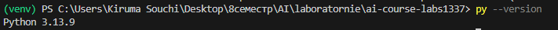
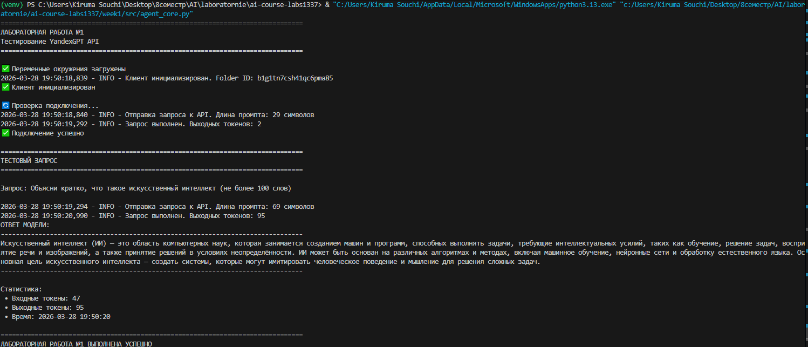
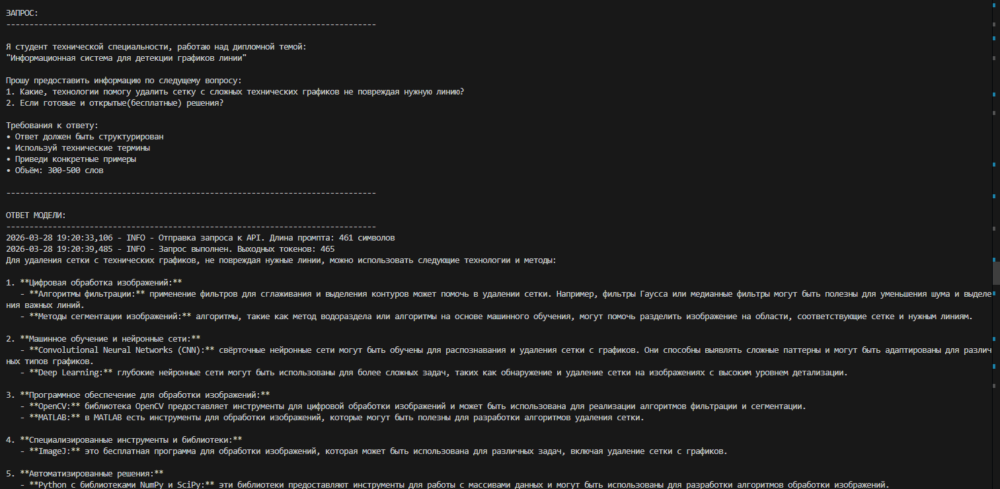

# Отчёт по лабораторной работе №1
## Дисциплина: Искусственный интеллект
---
## Общая информация
| Параметр | Значение |
|----------|----------|
| **Студент** | Мишакин Илья Геннадьевич |
| **Группа** | ФИТ-221 |
| **Дата выполнения** | 28.03.2026 |
| **Специальность** | Фундаментальная информатика и информационные технологии |
| **Тема диплома** | Информационная система распознавания данных с технических графиков |
---
## 1. Цель работы
Целью работы является ознакомление с основами языковыми моделями на примере я взял YandexGPT API. В ходе выполнения работы я изучил как взаимодействуются с облачными AI-сервисами, получение и использование API-ключей.
---
## 2. Выполненные задачи
- [ ] Настроено окружение Python 3.10+
- [ ] Создан GitHub-репозиторий
- [ ] Получены API-ключи Yandex Cloud
- [ ] Реализован базовый вызов API
- [ ] Выполнен адаптированный запрос
---
## 3. Ход работы
### 3.1. Настройка окружения

```bash
## Команды установки
python --version
pip install -r requirements.txt
```
### 3.2. Создание репозитория
- URL репозитория: `https://github.com/USERNAME/ai-course-labs`
- Текущая ветка: `week1`
### 3.3. Получение API-ключей

- Cloud ID: `b1g...`
- Folder ID: `b1g...`
### 3.4. Тестовый запрос
**Запрос:**
```
Объясни кратко, что такое искусственный интеллект
```
**Ответ:**
```
Искусственный интеллект (ИИ) — это область компьютерных наук, которая занимается созданием машин и программ, способных выполнять задачи, требующие интеллектуальных усилий, таких как обучение, решение задач, восприятие речи и изображений, а также принятие решений в условиях неопределённости. ИИ может быть основан на различных алгоритмах и методах, включая машинное обучение, нейронные сети и обработку естественного языка. Основная цель искусственного интеллекта — создать системы, которые могут имитировать человеческое поведение и мышление для решения сложных задач.
```


### 3.5. Адаптированный запрос
**Специальность:** Фундаментальная информатика и информационные технологии
**Запрос:**
```
Я студент технической специальности, работаю над дипломной темой:
"Информационная система для детекции графиков линии"

Прошу предоставить информацию по следущему вопросу:
1. Какие, технологии помогу удалить сетку с сложных технических графиков не повреждая нужную линию?
2. Если готовые и открытые(бесплатные) решения?

Требования к ответу:
• Ответ должен быть структурирован
• Используй технические термины
• Приведи конкретные примеры
• Объём: 300-500 слов
```
**Ответ:**
```
Для удаления сетки с технических графиков, не повреждая нужные линии, можно использовать различные технологии и методы обработки изображений. Вот некоторые из них:

1. **Цифровая обработка изображений:**
   - **Фильтрация:** применение фильтров для сглаживания или выделения определённых элементов изображения. Например, можно использовать фильтр Гаусса для сглаживания шума и уменьшения видимости сетки.
   - **Пороговая обработка:** установка порогового значения для разделения фона и линий на графике. Это может помочь выделить нужные линии и удалить сетку.
   - **Морфологическая обработка:** использование морфологических операций, таких как эрозия и дилатация, для изменения формы элементов изображения. Это может быть полезно для удаления мелких деталей, таких как сетка.

2. **Машинное обучение и компьютерное зрение:**
   - **Семантическая сегментация:** использование алгоритмов машинного обучения для разделения изображения на области с разными классами. В вашем случае можно обучить модель различать сетку и нужные линии на графике.
   - **Генеративно-состязательные сети (GAN):** GAN могут быть использованы для генерации новых изображений на основе существующих. В вашем случае можно обучить GAN генерировать графики без сетки на основе графиков с сеткой.

3. **Специализированные инструменты и библиотеки:**
   - **OpenCV:** библиотека для обработки изображений и компьютерного зрения, которая предоставляет множество функций для фильтрации, морфологической обработки и других операций.
   - **MATLAB:** программное обеспечение для научных вычислений и обработки данных, которое также имеет функции для обработки изображений.
   - **Python с библиотеками NumPy, SciPy и Matplotlib:** эти библиотеки предоставляют инструменты для работы с массивами данных, математическими функциями и визуализацией, которые могут быть полезны для обработки графиков.

4. **Готовые и открытые решения:**
   - **GIMP:** бесплатный графический редактор с открытым исходным кодом, который может быть использован для ручной обработки изображений и удаления сетки.
   - **ImageJ:** бесплатное программное обеспечение для обработки изображений с множеством плагинов и функций для анализа и обработки данных.
   - **Online-сервисы для обработки изображений:** существуют онлайн-сервисы, которые предоставляют инструменты для редактирования и обработки изображений, включая удаление сетки. Однако их использование может быть ограничено по функциональности или требовать регистрации.

Выбор конкретного метода или инструмента зависит от ваших требований, доступных ресурсов и уровня сложности задачи. Рекомендуется провести исследование и эксперименты с различными подходами, чтобы определить наиболее подходящий для вашей дипломной работы.
```

---
## 4. Результаты
| Критерий | Статус |
|----------|--------|
| Окружение настроено | ✅ |
| Репозиторий создан | ✅ |
| Ветка week1 создана | ✅ |
| API работает | ✅ |
| Адаптация выполнена | ✅ |
---
## 5. Выводы
В ходе работы были получены практические навыки взаимодействия с YandexGPT API через облако Yandex Cloud. Изучены основы аутентификации через IAM-токены, формирование запросов и вывод ответов. Основная трудность возникла при настройке API-ключей и не чуть не заблудился в самом сайте при настройке всего.
---
## 6. Список источников
1. Yandex Cloud Documentation. URL: https://cloud.yandex.ru/docs/
2. LangChain Documentation. URL: https://python.langchain.com/
3. GitHub Documentation. URL: https://docs.github.com/