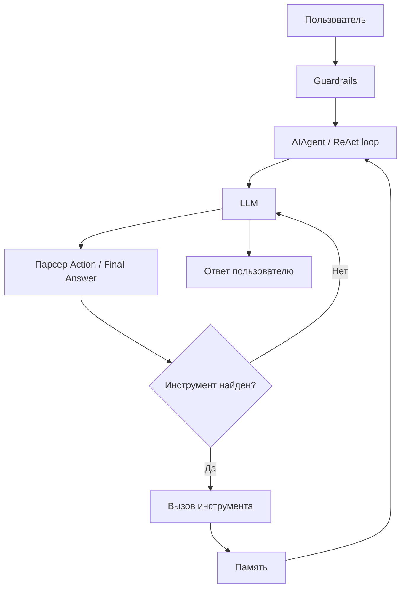

# Отчёт по лабораторной работе №2
## Дисциплина: Искусственный интеллект
---
## Общая информация
| Параметр | Значение |
|----------|----------|
| **Студент** | Мишакин Илья Геннадьевич |
| **Группа** | ФИТ-221 |
| **Дата выполнения** | 10.04.2026 |
| **Специальность** | Фундаментальная информатика и информационные технологии |
| **Тема диплома** | Информационная система распознавания данных с технических графиков |
---
## 1. Цель работы
Целью лабораторной работы было разработать AI-агента на базе LangChain, который умеет выбирать и вызывать инструменты под задачу, хранить рабочую и семантическую память, а также фильтровать небезопасные запросы.

Дополнительно нужно было закрепить навыки работы с архитектурой ReAct, научиться связывать несколько модулей в единую систему и подготовить основу для интеграции с дипломным проектом.
---
## 2. Выполненные задачи
- [x] Реализовано ядро AI-агента на LangChain
- [x] Добавлены инструменты для поиска, вычислений и специализированной обработки
- [x] Реализован кастомный инструмент для тематики распознавания графиков
- [x] Подключена рабочая память с ограничением размера
- [x] Подключена семантическая память на базе ChromaDB
- [x] Реализованы guardrails для проверки входных данных
- [x] Проведено тестирование и отладка ReAct-цикла
- [x] Подготовлено описание результатов и выводов
---
## 3. Ход работы
### 3.1. Архитектура агента
Основная логика агента реализована в файле `week2/src/agent_core.py`. При запуске происходит инициализация модели, инструментов, памяти и guardrails, после чего агент переходит в ReAct-цикл:



Ключевые компоненты системы:
- `week2/src/tools/search_tool.py` - инструмент поиска информации.
- `week2/src/tools/calc_tool.py` - безопасный калькулятор для математических выражений.
- `week2/src/tools/custom_tool.py` - специализированный инструмент под тематику диплома.
- `week2/src/memory/working_memory.py` - краткосрочная память текущей сессии.
- `week2/src/memory/semantic_memory.py` - семантическая память на базе ChromaDB.
- `week2/src/guardrails/input_validator.py` - проверка входного текста на опасные паттерны.

### 3.2. Реализованные инструменты
| Инструмент | Назначение | Параметры |
|-----------|-----------|-----------|
| `search_web` | Поиск актуальной информации по запросу | `query`, `num_results` |
| `calculate` | Безопасные вычисления выражений | `expression`, `precision` |
| `chart_curve_detector` | Специализированная обработка графиков и кривых | `query` |

Инструмент `search_web` в учебной версии возвращает mock-результаты в структурированном виде, чтобы сохранить совместимость с ReAct-подходом и не привязываться к внешнему API на этапе лабораторной работы.

### 3.3. Кастомный инструмент
Кастомный инструмент реализован в `week2/src/tools/custom_tool.py`. Он оформлен как класс `CustomTool`, наследующий `BaseTool`, и использует схему входных данных `CustomToolInput`.

Его задача - показать, как в агент можно подключить предметно-ориентированный модуль, связанный с дипломом. В текущей версии инструмент возвращает mock-результат с параметрами кривой, но интерфейс уже готов для замены на реальную CV-логику распознавания технических графиков.

Основная идея:
- единый интерфейс вызова через LangChain;
- строгая схема входных параметров;
- возможность расширения без изменения ядра агента.

### 3.4. Тестирование
Для проверки работы был запущен `week2/src/agent_core.py`. В процессе тестирования использовался запрос, требующий и поиска, и вычислений, что позволило проверить ReAct-цикл, работу инструментов и обновление памяти.

В ходе отладки была выявлена проблема в парсинге `Action`: прежнее регулярное выражение захватывало не только имя инструмента, но и строку `Action Input`, из-за чего агент не мог корректно выбрать инструмент и доходил до лимита итераций. После уточнения шаблона парсинга цикл стал работать корректно.

Дополнительно была проверена синтаксическая целостность файла командой:

```bash
python -m py_compile week2/src/agent_core.py
```

### 3.5. Интеграция с дипломом
Материалы лабораторной работы можно использовать в дипломном проекте как основу интеллектуального слоя системы распознавания данных с технических графиков.

Потенциальные направления интеграции:
- использование `chart_curve_detector` как модуля предварительной обработки графиков;
- сохранение истории диалогов и результатов распознавания в рабочей и семантической памяти;
- применение `calculate` для вспомогательных вычислений и оценки параметров кривых;
- применение `search_web` для поиска справочной информации по методам обработки изображений;
- применение guardrails для защиты от некорректных или вредоносных запросов.
---
## 4. Результаты
| Критерий | Статус |
|----------|--------|
| Агент реализован | ✅ |
| Инструменты созданы | ✅ |
| Память подключена | ✅ |
| Guardrails реализованы | ✅ |
| ReAct-цикл отлажен | ✅ |
| Код структурирован в репозитории | ✅ |
---
## 5. Выводы
В ходе лабораторной работы был разработан AI-агент с поддержкой нескольких инструментов, краткосрочной и семантической памяти, а также механизмов безопасности. На практике было полезно увидеть, как ReAct-подход связывает модель, инструменты и память в один цикл обработки запроса.

Отдельно была изучена проблема парсинга ответов модели: даже небольшая ошибка в регулярном выражении может полностью заблокировать работу агента и привести к бесконечному циклу итераций. После исправления этого участка логика выбора инструментов стала работать ожидаемым образом.

Полученный опыт пригодится при дальнейшем развитии дипломного проекта, особенно при интеграции модулей компьютерного зрения, хранения результатов и построения более устойчивого AI-ассистента.
---
## 6. Список источников
1. LangChain Documentation. URL: https://python.langchain.com/
2. ChromaDB Documentation. URL: https://docs.trychroma.com/
3. Yandex Cloud Documentation. URL: https://cloud.yandex.ru/docs/
4. Pydantic Documentation. URL: https://docs.pydantic.dev/
