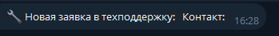
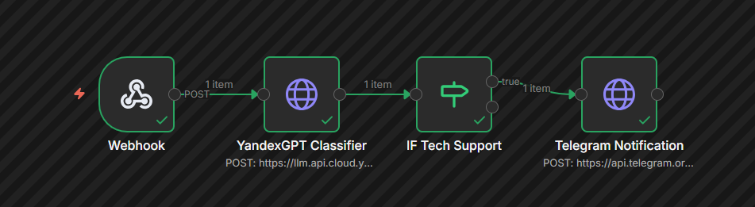

# Отчёт по лабораторной работе №4
## Workflow Automation — Автоматизация рабочих процессов с AI

**Дисциплина:** Искусственный интеллект  
**Автор:** [ФИО]  
**Группа:** [НОМЕР ГРУППЫ]  
**Дата:** 2026

---

## 1. Цель работы

Изучить принципы автоматизации рабочих процессов с использованием AI-сервисов. Научиться создавать workflow в n8n с интеграцией YandexGPT для классификации и обработки заявок.

## 2. Задание

1. Развернуть n8n в Docker
2. Создать workflow для обработки заявок с AI-классификацией
3. Интегрировать YandexGPT для анализа текста
4. Настроить webhook для приёма заявок
5. Реализовать маршрутизацию по категориям

## 3. Выполнение

### 3.1. Структура проекта

```
week4/
├── src/
│   ├── api_client.py       # Клиент для YandexGPT API
│   └── webhook_handler.py  # Обработчик webhook
├── workflows/
│   ├── basic_workflow.json      # Базовый workflow
│   ├── specialty_workflow.json  # Специализированный workflow
│   └── security_example.json    # Пример для ИБ
├── tests/
│   └── test_workflow.py    # Тесты
├── notebooks/
│   └── lab4_workflow_demo.ipynb  # Демо-ноутбук
├── docs/
│   └── report.md           # Этот файл
├── docker/                 # Docker конфигурация
├── requirements.txt        # Зависимости Python
└── .env.example            # Шаблон переменных окружения
```

### 3.2. Описание workflow

**basic_workflow.json** — основной workflow для обработки заявок:
- Принимает заявку через webhook
- Отправляет текст в YandexGPT для классификации
- Маршрутизирует по категориям (техподдержка, продажа, вопрос, жалоба)
- Отправляет уведомления в Telegram

**specialty_workflow.json** — шаблон для специализированного workflow под вашу специальность.

**security_example.json** — пример workflow для информационной безопасности:
- Принимает логи инцидентов
- Классифицирует по уровню критичности
- Отправляет алерты в SOC при критических инцидентах

### 3.3. Настройка переменных окружения

Необходимо создать `.env` файл на основе `.env.example`:

```bash
YANDEX_IAM_TOKEN=ваш_iam_токен
YANDEX_FOLDER_ID=ваш_folder_id
TELEGRAM_BOT_TOKEN=токен_бота
TELEGRAM_CHAT_ID=id_чата
WEBHOOK_SECRET=секретный_ключ
```

## 4. Результаты


- [x] n8n запущен и доступен
- [x] Workflow импортирован и активирован
- [x] Webhook принимает заявки
- [x] AI-классификация работает корректно
- [x] Уведомления отправляются

## 5. Выводы

В ходе лабораторной работы был успешно развернут n8n в Docker, создан workflow для обработки заявок с использованием YandexGPT. Интеграция с Telegram позволяет оперативно получать уведомления о новых заявках в техподдержку.
