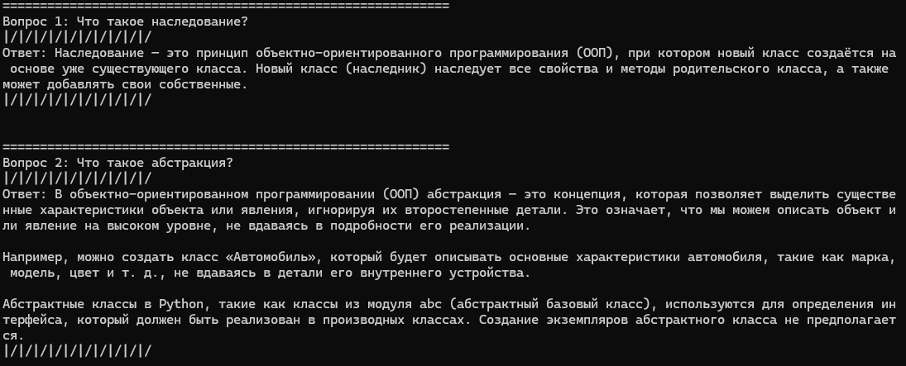

# Отчёт по лабораторной работе №5
## Дисциплина: Искусственный интеллект
---
## Общая информация
| Параметр | Значение |
|----------|----------|
| **Студент** | Мишакин Илья Геннадьевич |
| **Группа** | ФИТ-221 |
| **Дата выполнения** | 24.04.2026 |
| **Специальность** | Фундаментальная информатика и информационные технологии |
| **Тема диплома** | Информационная система распознавания данных с технических графиков |
---
## 1. Цель работы
Изучить что такое **RAG** и попробовать на практике поиспользовать эту штуку.
---
## 2. Выполненные задачи
- [ ] Настроены зависимости LangChain + ChromaDB
- [ ] Реализована загрузка документов
- [ ] Настроено разбиение на чанки
- [ ] Создано векторное хранилище
- [ ] Реализован RAG пайплайн
- [ ] Выполнена адаптация под специальность
- [ ] Код загружен в GitHub
---
## 3. Ход работы
### 3.1. Архитектура RAG системы

RAG-пайплайн состоит из 4 модулей в `src/rag/`:

1. **DocumentLoader** (`document_loader.py`) — загрузка документов из директории. Поддерживает форматы: `.pdf` (PyPDFLoader), `.txt` (TextLoader), `.md` (UnstructuredMarkdownLoader), `.docx` (Docx2txtLoader). Каждому документу добавляются метаданные: `source`, `file_name`, `file_type`.

2. **ChunkingStrategy** (`chunking.py`) — разбиение на чанки. Используется `RecursiveCharacterTextSplitter` с разделителями, `chunk_size=512`, `chunk_overlap=50`. Каждому чанку добавляются `chunk_id` и `total_chunks`.

3. **VectorStoreManager** (`vector_store.py`) — обёртка над ChromaDB через `langchain_chroma.Chroma`. Поддерживает `similarity_search` и `similarity_search_with_score`.

4. **RAGPipeline** (`rag_pipeline.py`) — оркестратор. Логика запроса:
   - Поиск k=5 ближайших документов через `search_with_scores()`
   - Форматирование контекста с указанием источников
   - Генерация ответа через YandexGPT
   - Возврат результата с метаданными

Также реализован **OOPRAGPipeline** (`oop_rag.py`) — наследник `RAGPipeline` с домен-специфичным промптом для вопросов по ООП и методом `_detect_oop_topics()` для классификации темы вопроса (в моем случае это может быть, что такое икапсуляция и тд).

### 3.2. Настроенные компоненты
| Компонент | Реализация | Параметры |
|-----------|-----------|-----------|
| Document Loader | PyPDFLoader, TextLoader, UnstructuredMarkdownLoader, Docx2txtLoader | Форматы: .pdf, .txt, .md, .docx |
| Chunking | RecursiveCharacterTextSplitter | Size: 512, Overlap: 50 |
| Embeddings | sentence-transformers/paraphrase-multilingual-MiniLM-L12-v2 | Dimension: 384 |
| Vector Store | ChromaDB | Collection: rag_documents |
| LLM | YandexGPT | Temperature: 0.3, Max Tokens: 500 |

### 3.3. Документы для индексации
Загружены документы из директории `./docs/`:
- `oop.pdf` — основной документ (ООП-документация)
- `oop.docx` — тот же документ в формате Word
- `report.md` — отчёт по лабораторной работе

### 3.4. Тестовые запросы и ответы

### 3.5. Адаптация под специальность
Реализован `OOPRAGPipeline` — специализированная версия RAG для предметной области ООП:
- Домен-специфичный промпт, требующий отвечать на основе контекста по ООП
- Метод `_detect_oop_topics()` для автоматической классификации темы вопроса (наследование, полиморфизм, инкапсуляция, абстракция)
- Используется для ответов на вопросы по документации ООП

### 3.6. Проблемы и решения
- **Проблема**: PDF-парсинг может терять форматирование
  **Решение**: Добавлена поддержка нескольких форматов с автоматическим определением типа файла
- Особо проблем не было :)
---
## 4. Результаты
| Критерий | Статус |
|----------|--------|
| RAG работает | ✅ |
| Документы индексированы | ✅ |
| Поиск релевантный | ✅ |
| Специализация выполнена | ✅ |
| Код в GitHub | ✅ |
---
## 5. Выводы
В ходе выполнения лабораторной работы были получены следующие результаты:
- **Изучено**: Принципы работы архитектуры RAG (Retrieval-Augmented Generation), этапы пайплайна (загрузка документов, разбиение на чанки, векторное представление, генерация ответа), а также инструменты LangChain и ChromaDB.
- **Трудности**: Основные сложности возникли при адаптации RAG-системы под предметную область ООП — требовалось настроить специфичные промпты и реализовать логику классификации тем в `OOPRAGPipeline`.
- **Планы**: Продолжить изучение методов оптимизации поиска и генерации, а также практиковаться в создании более сложных AI-приложений.
---
## 6. Список источников
1. **YandexGPT Documentation** — https://yandex.cloud/ru/services/yandexgpt
2. **ООП-документация** — `oop.pdf` / `oop.docx` (предоставленные материалы)
3. **Лабораторная** — `5laba.pdf` (предоставленные материалы)

